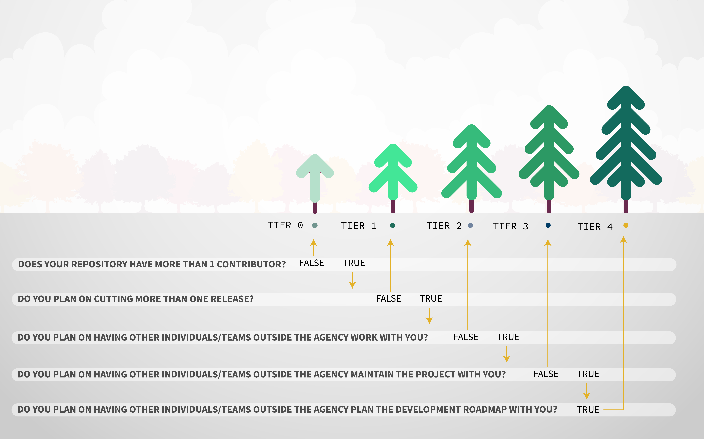

# Maturity Model Tiers

Our maturity model framework is designed to evaluate and categorize open source repositories based on its level of maturity and development. This framework consists of five tiers (0-4), each representing different stages of a project's maturity, collaboration scope, community engagement, and governance structure.

- [Tier 0](./tier0/README.md): Private Repository
- [Tier 1](./tier1/README.md): One-Time Release
- [Tier 2](./tier2/README.md): Close Collaboration
- [Tier 3](./tier3/README.md): Working in Public
- [Tier 4](./tier4/README.md): Community Governance

Different projects have varying needs based on their scope, team size, and community involvement. The framework establishes clear requirements for documentation, collaboration, and governance, ranging from small private repositories (Tier 0) to fully community-governed projects (Tier 4). Each tier has specific mandatory, recommended, and not recommended elements that help guide projects based on the stage of their open source development journey.

## Tier Definitions

<table>
  <thead>
    <tr>
      <th>Level</th>
      <th>Name</th>
      <th>Purpose</th>
      <th>Description</th>
    </tr>
  </thead>
  <tbody>
    <tr>
      <td>Tier 0</td>
      <td>Private Repository</td>
      <td>Experimental/Historical</td>
      <td>Project is private, usually with a single developer. Typically working projects, example code, and early prototypes.</td>
    </tr>
    <tr>
      <td>Tier 1</td>
      <td>One-Time Release</td>
      <td>Informational/Historical</td>
      <td>Project released publicly, but without planned future activity or maintenance from original author(s).</td>
    </tr>
    <tr>
      <td>Tier 2</td>
      <td>Close Collaboration</td>
      <td>Collaborate with smaller, mostly internal teams</td>
      <td>Project within a team or Operational Division (OpDiv), Internal Repo for Innersource-style work.</td>
    </tr>
    <tr>
      <td>Tier 3</td>
      <td>Working in Public</td>
      <td>Collaborate in the Open with smaller, semi-open teams</td>
      <td>Project developed Open Source by CMS or a CMS contractor, public website hosted on GitHub, tool or utility used in CMS official business by the public. Limited external contribution, CMS-led (by choice or by statute).</td>
    </tr>
    <tr>
      <td>Tier 4</td>
      <td>Community Governance</td>
      <td>Collaborate broadly in public</td>
      <td>Project donated to or stewarded by an external community, open standard that welcomes public input, mature open source project that purposefully develops an open governance structure.</td>
    </tr>
  </tbody>
</table>

### Determining a project's maturity model tier

Use the series of questions below to identify your project's maturity model tier

## Repository File Requirements by Tier

Each tier requires certain files that must be included in the repository.

| Level                                  | Description     |
| -------------------------------------- | --------------- |
| $\color{green}\large{\textsf{M}}$      | Mandatory       |
| $\color{blue}\large{\textsf{R}}$       | Recommended     |
| $\color{lightcoral}\large{\textsf{N}}$ | Not Recommended |

| File                                                                           | Tier 0                                 | Tier 1                                 | Tier 2                                 | Tier 3                            | Tier 4                            |
| ------------------------------------------------------------------------------ | -------------------------------------- | -------------------------------------- | -------------------------------------- | --------------------------------- | --------------------------------- |
| LICENSE                                                                        | $\color{green}\large{\textsf{M}}$      | $\color{green}\large{\textsf{M}}$      | $\color{green}\large{\textsf{M}}$      | $\color{green}\large{\textsf{M}}$ | $\color{green}\large{\textsf{M}}$ |
| [code.json](https://github.com/DSACMS/gov-codejson/blob/main/docs/metadata.md) | $\color{green}\large{\textsf{M}}$      | $\color{green}\large{\textsf{M}}$      | $\color{green}\large{\textsf{M}}$      | $\color{green}\large{\textsf{M}}$ | $\color{green}\large{\textsf{M}}$ |
| README.md                                                                      | $\color{green}\large{\textsf{M}}$      | $\color{green}\large{\textsf{M}}$      | $\color{green}\large{\textsf{M}}$      | $\color{green}\large{\textsf{M}}$ | $\color{green}\large{\textsf{M}}$ |
| COMMUNITY.md                                                                   | $\color{green}\large{\textsf{M}}$      | $\color{green}\large{\textsf{M}}$      | $\color{green}\large{\textsf{M}}$      | $\color{green}\large{\textsf{M}}$ | $\color{green}\large{\textsf{M}}$ |
| SECURITY.md                                                                    | $\color{blue}\large{\textsf{R}}$       | $\color{green}\large{\textsf{M}}$      | $\color{green}\large{\textsf{M}}$      | $\color{green}\large{\textsf{M}}$ | $\color{green}\large{\textsf{M}}$ |
| CONTRIBUTING.md                                                                | $\color{blue}\large{\textsf{R}}$       | $\color{blue}\large{\textsf{R}}$       | $\color{green}\large{\textsf{M}}$      | $\color{green}\large{\textsf{M}}$ | $\color{green}\large{\textsf{M}}$ |
| CODE_OF_CONDUCT.md                                                             | $\color{lightcoral}\large{\textsf{N}}$ | $\color{lightcoral}\large{\textsf{N}}$ | $\color{green}\large{\textsf{M}}$      | $\color{green}\large{\textsf{M}}$ | $\color{green}\large{\textsf{M}}$ |
| GOVERNANCE.md                                                                  | $\color{lightcoral}\large{\textsf{N}}$ | $\color{lightcoral}\large{\textsf{N}}$ | $\color{lightcoral}\large{\textsf{N}}$ | $\color{blue}\large{\textsf{R}}$  | $\color{green}\large{\textsf{M}}$ |

## Repository File Content Requirements by Tier

Each tier outlines specific content that are required or recommended to be included in files of the repository.

<table>
  <thead>
    <tr>
      <th>File</th>
      <th>Sections</th>
      <th>Tier 0</th>
      <th>Tier 1</th>
      <th>Tier 2</th>
      <th>Tier 3</th>
      <th>Tier 4</th>
      <th>Notes</th>
    </tr>
  </thead>
  <tbody>
    <tr>
      <td>LICENSE</td>
      <td>License</td>
      <td>$\color{green}\large{\textsf{M}}$</td>
      <td>$\color{green}\large{\textsf{M}}$</td>
      <td>$\color{green}\large{\textsf{M}}$</td>
      <td>$\color{green}\large{\textsf{M}}$</td>
      <td>$\color{green}\large{\textsf{M}}$</td>
      <td>All repositories, whether private or public, must include authorship and copyright information. By default, work done by federal employees is not subject to copyright protections under Title 17 U.S. Code Sections 101 & 105, unless for security or contracting purposes.</td>
    </tr>
        <tr>
      <td>code.json</td>
      <td><a href="https://github.com/DSACMS/gov-codejson/blob/main/schemas">Metadata</a></td>
      <td>$\color{green}\large{\textsf{M}}$</td>
      <td>$\color{green}\large{\textsf{M}}$</td>
      <td>$\color{green}\large{\textsf{M}}$</td>
      <td>$\color{green}\large{\textsf{M}}$</td>
      <td>$\color{green}\large{\textsf{M}}$</td>
      <td>All repositories, whether private or public, must include a code.json file containing project metadata. For more information, visit the <a href="https://github.com/DSACMS/gov-codejson">code.json documentation repository</a>.</td>
    </tr>
    <tr>
      <td rowspan="20">README.md</td>
      <td>Project Description</td>
      <td>$\color{green}\large{\textsf{M}}$</td>
      <td>$\color{green}\large{\textsf{M}}$</td>
      <td>$\color{green}\large{\textsf{M}}$</td>
      <td>$\color{green}\large{\textsf{M}}$</td>
      <td>$\color{green}\large{\textsf{M}}$</td>
      <td>This should be 1-3 sentence short description of the project that can be used as a 'one-liner' to describe the repo. A best practice is using this same language as the official 'description' on a GitHub repo landing page.</td>
    </tr>
    <tr>
      <!-- <td>README.md</td> -->
      <td>About the Project</td>
      <td>$\color{green}\large{\textsf{M}}$</td>
      <td>$\color{green}\large{\textsf{M}}$</td>
      <td>$\color{green}\large{\textsf{M}}$</td>
      <td>$\color{green}\large{\textsf{M}}$</td>
      <td>$\color{green}\large{\textsf{M}}$</td>
      <td>This should be a longer-form description of the project. It can include history, background, details, problem statements, links to design documents or other supporting materials, or any other information/context that a user or contributor might be interested in.</td>
    </tr>
    <tr>
      <!-- <td>README.md</td> -->
      <td>Project Vision</td>
      <td>$\color{blue}\large{\textsf{R}}$</td>
      <td>$\color{lightcoral}\large{\textsf{N}}$</td>
      <td>$\color{green}\large{\textsf{M}}$</td>
      <td>$\color{blue}\large{\textsf{R}}$</td>
      <td>$\color{blue}\large{\textsf{R}}$</td>
      <td>This should be a forward-looking statement that outlines the desired future state or long-term goals of the project.</td>
    </tr>
    <tr>
      <!-- <td>README.md</td> -->
      <td>Project Mission</td>
      <td style=>$\color{blue}\large{\textsf{R}}$</td>
      <td style=>$\color{blue}\large{\textsf{R}}$</td>
      <td style=>$\color{green}\large{\textsf{M}}$</td>
      <td style=>$\color{blue}\large{\textsf{R}}$</td>
      <td style=>$\color{blue}\large{\textsf{R}}$</td>
      <td>This should be a statement that defines the purpose, scope, and specific objectives of the project.</td>
    </tr>
    <tr>
      <!-- <td>README.md</td> -->
      <td>Agency Mission</td>
      <td>$\color{blue}\large{\textsf{R}}$</td>
      <td>$\color{blue}\large{\textsf{R}}$</td>
      <td>$\color{green}\large{\textsf{M}}$</td>
      <td>$\color{blue}\large{\textsf{R}}$</td>
      <td>$\color{lightcoral}\large{\textsf{N}}$</td>
      <td>Agency-led projects should include information about their agency mission. This should be taken directly from agency websites or wikis.</td>
    </tr>
    <tr>
      <!-- <td>README.md</td> -->
      <td>Team Mission</td>
      <td>$\color{blue}\large{\textsf{R}}$</td>
      <td>$\color{blue}\large{\textsf{R}}$</td>
      <td>$\color{green}\large{\textsf{M}}$</td>
      <td>$\color{blue}\large{\textsf{R}}$</td>
      <td>$\color{lightcoral}\large{\textsf{N}}$</td>
      <td>Agency-led projects should include information about the team executing on the mission. This should be taken directly from internal team charters and functional statements.</td>
    </tr>
    <tr>
      <!-- <td>README.md</td> -->
      <td>Core Team</td>
      <td>$\color{blue}\large{\textsf{R}}$</td>
      <td>$\color{green}\large{\textsf{M}}$</td>
      <td>$\color{green}\large{\textsf{M}}$</td>
      <td>$\color{green}\large{\textsf{M}}$</td>
      <td>$\color{green}\large{\textsf{M}}$</td>
      <td>This information helps with succession planning and provenance for security compliance and remediation. It helps future users and contributors understand where the code originated.</td>
    </tr>
    <tr>
      <!-- <td>README.md</td> -->
      <td>Repository Structure</td>
      <td>$\color{blue}\large{\textsf{R}}$</td>
      <td>$\color{blue}\large{\textsf{R}}$</td>
      <td>$\color{blue}\large{\textsf{R}}$</td>
      <td>$\color{green}\large{\textsf{M}}$</td>
      <td>$\color{green}\large{\textsf{M}}$</td>
      <td>Including the repository structure helps viewers quickly understand the project layout. Using the "tree -d" command can be a helpful way to generate this information, but, be sure to update it as the project evolves and changes over time. It is also helpful to include a 'table of contents" for your documentation. Tier 0/1 projects with simple README.md files without many sections may or may not need this, but it is still extremely helpful to provide "bookmark" or "anchor" links to specific sections of your file to be referenced in tickets, docs, or other communication channels.</td>
    </tr>
    <tr>
      <!-- <td>README.md</td> -->
      <td>Development and Software Delivery Lifecycle</td>
      <td>$\color{lightcoral}\large{\textsf{N}}$</td>
      <td>$\color{blue}\large{\textsf{R}}$</td>
      <td>$\color{blue}\large{\textsf{R}}$</td>
      <td>$\color{green}\large{\textsf{M}}$</td>
      <td>$\color{green}\large{\textsf{M}}$</td>
      <td>Tier 1: Even if the lifecycle is "one-time release" being explicit is better than implicit.</td>
    </tr>
    <tr>
      <!-- <td>README.md</td> -->
      <td>Local Development</td>
      <td>$\color{blue}\large{\textsf{R}}$</td>
      <td>$\color{blue}\large{\textsf{R}}$</td>
      <td>$\color{green}\large{\textsf{M}}$</td>
      <td>$\color{green}\large{\textsf{M}}$</td>
      <td>$\color{green}\large{\textsf{M}}$</td>
      <td>Use step by step instructions to get from 'zero' to 'running code.' Should include any system libraries or packages that are a 'pre-requisite' to installation of your project. When possible, including install instructions for multiple Operation Systems (or being explicit about which operating system the project was developed on) is a recommended practice.</td>
    </tr>
    <tr>
      <!-- <td>README.md</td> -->
      <td>Coding Style and Linters</td>
      <td>$\color{blue}\large{\textsf{R}}$</td>
      <td>$\color{blue}\large{\textsf{R}}$</td>
      <td>$\color{green}\large{\textsf{M}}$</td>
      <td>$\color{green}\large{\textsf{M}}$</td>
      <td>$\color{green}\large{\textsf{M}}$</td>
      <td>This section outlines best practices contributors should follow to reduce friction and improve readability, functionality, and quality of contributions to a project. Oftentimes, these checks can be automated and run as part of a continuous integration and deployment pipeline.</td>
    </tr>
    <tr>
      <!-- <td>README.md</td> -->
      <td>Branching Model</td>
      <td>$\color{blue}\large{\textsf{R}}$</td>
      <td>$\color{blue}\large{\textsf{R}}$</td>
      <td>$\color{blue}\large{\textsf{R}}$</td>
      <td>$\color{green}\large{\textsf{M}}$</td>
      <td>$\color{green}\large{\textsf{M}}$</td>
      <td>Even for Tier 0/1 projects with one or a few contributors, branching models (such as git flow) are still recommended as a best practice for keeping feature development history clear, and to help reinforce development best practices.</td>
    </tr>
    <tr>
      <!-- <td>README.md</td> -->
      <td>Contributing</td>
      <td>$\color{lightcoral}\large{\textsf{N}}$</td>
      <td>$\color{blue}\large{\textsf{R}}$</td>
      <td>$\color{green}\large{\textsf{M}}$</td>
      <td>$\color{green}\large{\textsf{M}}$</td>
      <td>$\color{green}\large{\textsf{M}}$</td>
      <td>For projects that accept contributions, point towards the CONTRIBUTING.md file. For those that do not (tier0/1) not recommended to include this section, instead, mention one-time release, or private repo status instead.</td>
    </tr>
    <tr>
      <!-- <td>README.md</td> -->
      <td>Community</td>
      <td>$\color{blue}\large{\textsf{R}}$</td>
      <td>$\color{blue}\large{\textsf{R}}$</td>
      <td>$\color{green}\large{\textsf{M}}$</td>
      <td>$\color{green}\large{\textsf{M}}$</td>
      <td>$\color{green}\large{\textsf{M}}$</td>
      <td>For projects that are higher tier than a one-time release, pointing your contributors towards wherever your community exists (e.g. email lists, online discussion boards or channels, project backlogs and documentation, etc...).</td>
    </tr>
    <tr>
      <!-- <td>README.md</td> -->
      <td>Community Guidelines</td>
      <td>$\color{blue}\large{\textsf{R}}$</td>
      <td>$\color{blue}\large{\textsf{R}}$</td>
      <td>$\color{green}\large{\textsf{M}}$</td>
      <td>$\color{green}\large{\textsf{M}}$</td>
      <td>$\color{green}\large{\textsf{M}}$</td>
      <td>Project tiers above one-time release should point towards a CODE_OF_CONDUCT.md file or website providing information around acceptable conduct and reporting mechanisms and escalation strategies. It is better to have these processes defined before they are needed, so you can focus on support if/when there is an incident (e.g. Contributor-covenant.org).</td>
    </tr>
    <tr>
      <!-- <td>README.md</td> -->
      <td>Governance</td>
      <td>$\color{lightcoral}\large{\textsf{N}}$</td>
      <td>$\color{lightcoral}\large{\textsf{N}}$</td>
      <td>$\color{blue}\large{\textsf{R}}$</td>
      <td>$\color{blue}\large{\textsf{R}}$</td>
      <td>$\color{green}\large{\textsf{M}}$</td>
      <td>Make a short statement about how the project is governed (formally, or informally) and link to the GOVERNANCE.md file.</td>
    </tr>
    <tr>
      <!-- <td>README.md</td> -->
      <td>Feedback</td>
      <td>$\color{lightcoral}\large{\textsf{N}}$</td>
      <td>$\color{blue}\large{\textsf{R}}$</td>
      <td>$\color{blue}\large{\textsf{R}}$</td>
      <td>$\color{green}\large{\textsf{M}}$</td>
      <td>$\color{green}\large{\textsf{M}}$</td>
      <td>Direct users towards the channel where they're encouraged to provide feedback, typically a github.com/$REPO/issue/new URL .</td>
    </tr>
    <tr>
      <!-- <td>README.md</td> -->
      <td>Glossary</td>
      <td>$\color{blue}\large{\textsf{R}}$</td>
      <td>$\color{blue}\large{\textsf{R}}$</td>
      <td>$\color{blue}\large{\textsf{R}}$</td>
      <td>$\color{blue}\large{\textsf{R}}$</td>
      <td>$\color{green}\large{\textsf{M}}$</td>
      <td>Even for early-tier projects, this documentation can be extremely valuable. Good candidate content includes any project-specific acronyms (esp applicable for Government projects) and any critical Subject Matter Expertise related vocabulary for people who are new to the domain your project is within.</td>
    </tr>
    <tr>
      <!-- <td>README.md</td> -->
      <td>Policies</td>
      <td>$\color{green}\large{\textsf{M}}$</td>
      <td>$\color{green}\large{\textsf{M}}$</td>
      <td>$\color{green}\large{\textsf{M}}$</td>
      <td>$\color{green}\large{\textsf{M}}$</td>
      <td>$\color{green}\large{\textsf{M}}$</td>
      <td>This section is to explicitly link to Federal policies and guidelines that are required or recommended for Federal projects to comply with, such as  Accessibility (508) Interoperability, Anti-deficiency, Security, Licensing, and other policies that can vary between agencies and domains.</td>
    </tr>
    <tr>
      <!-- <td>README.md</td> -->
      <td>Public Domain</td>
      <td>$\color{green}\large{\textsf{M}}$</td>
      <td>$\color{green}\large{\textsf{M}}$</td>
      <td>$\color{green}\large{\textsf{M}}$</td>
      <td>$\color{green}\large{\textsf{M}}$</td>
      <td>$\color{green}\large{\textsf{M}}$</td>
      <td>A best practice is to list the LICENSE under which a project is released at the bottom of the README. In most cases for Federal repos, we default to Creative Commons Zero 1.0 International (world-wide public domain).</td>
    </tr>
        <tr>
      <td rowspan="10">COMMUNITY.md</td>
      <td>Table of Project Members</td>
      <td>$\color{green}\large{\textsf{M}}$</td>
      <td>$\color{green}\large{\textsf{M}}$</td>
      <td>$\color{green}\large{\textsf{M}}$</td>
      <td>$\color{green}\large{\textsf{M}}$</td>
      <td>$\color{green}\large{\textsf{M}}$</td>
      <td>Who are the points of contact in your project who are responsible/accountable for the project? This can often be an engineering or design manager or leader, who may or may not be the primary maintainers of the project.</td>
    </tr>
    <tr>
      <!-- <td>COMMUNITY.md</td> -->
      <td>Roles & Responsibilities</td>
      <td>$\color{lightcoral}\large{\textsf{N}}$</td>
      <td>$\color{lightcoral}\large{\textsf{N}}$</td>
      <td>$\color{blue}\large{\textsf{R}}$</td>
      <td>$\color{green}\large{\textsf{M}}$</td>
      <td>$\color{green}\large{\textsf{M}}$</td>
      <td>Who are the project maintainers? List out @USERNAMES where possible so they can be tagged in issues/PRs directly.</td>
    </tr>
    <tr>
      <!-- <td>COMMUNITY.md</td> -->
      <td>Maintainers List</td>
      <td>$\color{lightcoral}\large{\textsf{N}}$</td>
      <td>$\color{lightcoral}\large{\textsf{N}}$</td>
      <td>$\color{blue}\large{\textsf{R}}$</td>
      <td>$\color{green}\large{\textsf{M}}$</td>
      <td>$\color{green}\large{\textsf{M}}$</td>
      <td>What groups/domains are maintainers a part of? Does your project have domains/areas that are maintained by specific people? List @USERNAMES directly, or any @ALIASES for groups/teams.</td>
    </tr>
    <tr>
      <!-- <td>COMMUNITY.md</td> -->
      <td>Approvers List</td>
      <td>$\color{lightcoral}\large{\textsf{N}}$</td>
      <td>$\color{lightcoral}\large{\textsf{N}}$</td>
      <td>$\color{blue}\large{\textsf{R}}$</td>
      <td>$\color{green}\large{\textsf{M}}$</td>
      <td>$\color{green}\large{\textsf{M}}$</td>
      <td>Who are the project approvers? List out @USERNAMES where possible so they can be tagged in issues/PRs directly.</td>
    </tr>
    <tr>
      <!-- <td>COMMUNITY.md</td> -->
      <td>Reviewers List</td>
      <td>$\color{lightcoral}\large{\textsf{N}}$</td>
      <td>$\color{lightcoral}\large{\textsf{N}}$</td>
      <td>$\color{blue}\large{\textsf{R}}$</td>
      <td>$\color{green}\large{\textsf{M}}$</td>
      <td>$\color{green}\large{\textsf{M}}$</td>
      <td>Who are the project reviewers? List out @USERNAMES where possible so they can be tagged in issues/PRs directly.</td>
    </tr>
    <tr>
      <!-- <td>COMMUNITY.md</td> -->
      <td>Contributors</td>
      <td>$\color{lightcoral}\large{\textsf{N}}$</td>
      <td>$\color{lightcoral}\large{\textsf{N}}$</td>
      <td>$\color{blue}\large{\textsf{R}}$</td>
      <td>$\color{green}\large{\textsf{M}}$</td>
      <td>$\color{green}\large{\textsf{M}}$</td>
      <td>Who has contributed to the project? Highlight and credit the users who have contributed to the repository.</td>
    </tr>
    <tr>
      <!-- <td>COMMUNITY.md</td> -->
      <td>Alumni</td>
      <td>$\color{lightcoral}\large{\textsf{N}}$</td>
      <td>$\color{lightcoral}\large{\textsf{N}}$</td>
      <td>$\color{blue}\large{\textsf{R}}$</td>
      <td>$\color{blue}\large{\textsf{R}}$</td>
      <td>$\color{green}\large{\textsf{M}}$</td>
      <td>Who are the past maintainers or contributors who previously played significant roles in this project who are no longer actively involved? Consider including their roles and dates for context.</td>
    </tr>
    <tr>
      <!-- <td>COMMUNITY.md</td> -->
      <td>Principles</td>
      <td>$\color{lightcoral}\large{\textsf{N}}$</td>
      <td>$\color{lightcoral}\large{\textsf{N}}$</td>
      <td>$\color{green}\large{\textsf{M}}$</td>
      <td>$\color{green}\large{\textsf{M}}$</td>
      <td>$\color{green}\large{\textsf{M}}$</td>
      <td>This section communicates to prospective contributors and users what the values of your community are. The examples provided in the template were established by the Justice40 project at USDS.</td>
    </tr>
    <tr>
      <!-- <td>COMMUNITY.md</td> -->
      <td>Community Guidelines</td>
      <td>$\color{lightcoral}\large{\textsf{N}}$</td>
      <td>$\color{lightcoral}\large{\textsf{N}}$</td>
      <td>$\color{green}\large{\textsf{M}}$</td>
      <td>$\color{green}\large{\textsf{M}}$</td>
      <td>$\color{green}\large{\textsf{M}}$</td>
      <td>This section communicates specific norms and guidelines for how to participate and contribute positively to your community. The more explicit you can be about behaviors you'd like to encourage or discourage, the less friction new contributors will experience in onboarding and operating within your project.</td>
    </tr>
    <tr>
      <!-- <td>COMMUNITY.md</td> -->
      <td>Acknowledgements</td>
      <td>$\color{lightcoral}\large{\textsf{N}}$</td>
      <td>$\color{lightcoral}\large{\textsf{N}}$</td>
      <td>$\color{green}\large{\textsf{M}}$</td>
      <td>$\color{green}\large{\textsf{M}}$</td>
      <td>$\color{green}\large{\textsf{M}}$</td>
      <td>This section recognizes previous work and best practices established by the other members of the federal open source community such as USDS, GSA, 18F, and the Justice40 Project.</td>
    </tr>
    <tr>
      <td>SECURITY.md</td>
      <td>Security & Responsible Disclosure Policy</td>
      <td>$\color{blue}\large{\textsf{R}}$</td>
      <td>$\color{green}\large{\textsf{M}}$</td>
      <td>$\color{green}\large{\textsf{M}}$</td>
      <td>$\color{green}\large{\textsf{M}}$</td>
      <td>$\color{green}\large{\textsf{M}}$</td>
      <td>This outlines the Security & Responsibility Disclosure policies including vulnerability submission, etc.</td>
    </tr>
    <tr>
      <td rowspan="15">CONTRIBUTING.md</td>
      <td>How to Contribute</td>
      <td>$\color{blue}\large{\textsf{R}}$</td>
      <td>$\color{blue}\large{\textsf{R}}$</td>
      <td>$\color{green}\large{\textsf{M}}$</td>
      <td>$\color{green}\large{\textsf{M}}$</td>
      <td>$\color{green}\large{\textsf{M}}$</td>
      <td>Basic instructions about where to send patches, check out source code, and get development support.</td>
    </tr>
    <tr>
      <!-- <td>CONTRIBUTING.md</td> -->
      <td>Getting Started</td>
      <td>$\color{blue}\large{\textsf{R}}$</td>
      <td>$\color{green}\large{\textsf{M}}$</td>
      <td>$\color{green}\large{\textsf{M}}$</td>
      <td>$\color{green}\large{\textsf{M}}$</td>
      <td>$\color{green}\large{\textsf{M}}$</td>
      <td>Often includes installation steps, pre-requisites for installation, and instuctions for working with the source code.</td>
    </tr>
    <tr>
      <!-- <td>CONTRIBUTING.md</td> -->
      <td>Team Specific Guidelines</td>
      <td>$\color{lightcoral}\large{\textsf{N}}$</td>
      <td>$\color{lightcoral}\large{\textsf{N}}$</td>
      <td>$\color{blue}\large{\textsf{R}}$</td>
      <td>$\color{green}\large{\textsf{M}}$</td>
      <td>$\color{green}\large{\textsf{M}}$</td>
      <td>This section helps contributors understand any team structure in the project (formal or informal.) Encouraged to point towards the COMMUNITY.md file for further details.</td>
    </tr>
    <tr>
      <!-- <td>CONTRIBUTING.md</td> -->
      <td>Building dependencies</td>
      <td>$\color{blue}\large{\textsf{R}}$</td>
      <td>$\color{green}\large{\textsf{M}}$</td>
      <td>$\color{green}\large{\textsf{M}}$</td>
      <td>$\color{green}\large{\textsf{M}}$</td>
      <td>$\color{green}\large{\textsf{M}}$</td>
      <td>This step is often skipped, so don't forget to include the steps needed to install on your platform. If you project can be multi-platform, this is an excellent place for first time contributors to send patches!</td>
    </tr>
    <tr>
      <!-- <td>CONTRIBUTING.md</td> -->
      <td>Building the Project</td>
      <td>$\color{blue}\large{\textsf{R}}$</td>
      <td>$\color{green}\large{\textsf{M}}$</td>
      <td>$\color{green}\large{\textsf{M}}$</td>
      <td>$\color{green}\large{\textsf{M}}$</td>
      <td>$\color{green}\large{\textsf{M}}$</td>
      <td>Be sure to include build scripts and instructions, not just the source code itself!</td>
    </tr>
    <tr>
      <!-- <td>CONTRIBUTING.md</td> -->
      <td>Workflow and Branching</td>
      <td>$\color{blue}\large{\textsf{R}}$</td>
      <td>$\color{blue}\large{\textsf{R}}$</td>
      <td>$\color{green}\large{\textsf{M}}$</td>
      <td>$\color{green}\large{\textsf{M}}$</td>
      <td>$\color{green}\large{\textsf{M}}$</td>
      <td>If your project has a preferred workflow or branching structure, mention it here. We recommend 'git flow' as a good default.</td>
    </tr>
    <tr>
      <!-- <td>CONTRIBUTING.md</td> -->
      <td>Testing Conventions</td>
      <td>$\color{blue}\large{\textsf{R}}$</td>
      <td>$\color{blue}\large{\textsf{R}}$</td>
      <td>$\color{blue}\large{\textsf{R}}$</td>
      <td>$\color{green}\large{\textsf{M}}$</td>
      <td>$\color{green}\large{\textsf{M}}$</td>
      <td>Discuss where tests can be found, how they are run, and what kind of tests/coverage strategy and goals the project has.</td>
    </tr>
    <tr>
      <!-- <td>CONTRIBUTING.md</td> -->
      <td>Coding Style and Linters</td>
      <td>$\color{blue}\large{\textsf{R}}$</td>
      <td>$\color{blue}\large{\textsf{R}}$</td>
      <td>$\color{green}\large{\textsf{M}}$</td>
      <td>$\color{green}\large{\textsf{M}}$</td>
      <td>$\color{green}\large{\textsf{M}}$</td>
      <td>HIGHLY ENCOURAGED. Specific tools will vary between different languages/frameworks (e.g. Black for python, esliint for JavaScript, etc...)</td>
    </tr>
    <tr>
      <!-- <td>CONTRIBUTING.md</td> -->
      <td>Writing Issues</td>
      <td>$\color{blue}\large{\textsf{R}}$</td>
      <td>$\color{green}\large{\textsf{M}}$</td>
      <td>$\color{green}\large{\textsf{M}}$</td>
      <td>$\color{green}\large{\textsf{M}}$</td>
      <td>$\color{green}\large{\textsf{M}}$</td>
      <td>Make a brief statement about where to file issues, and conventions for doing so. Link to ISSUE_TEMPLATE.md file.</td>
    </tr>
    <tr>
      <!-- <td>CONTRIBUTING.md</td> -->
      <td>Writing Pull Requests</td>
      <td>$\color{lightcoral}\large{\textsf{N}}$</td>
      <td>$\color{lightcoral}\large{\textsf{N}}$</td>
      <td>$\color{blue}\large{\textsf{R}}$</td>
      <td>$\color{green}\large{\textsf{M}}$</td>
      <td>$\color{green}\large{\textsf{M}}$</td>
      <td>Make a brief statement about where to file pull/merge requests, and conventions for doing so. Link to PULL_REQUEST_TEMPLATE.md file.</td>
    </tr>
    <tr>
      <!-- <td>CONTRIBUTING.md</td> -->
      <td>Reviewing Pull Requests</td>
      <td>$\color{lightcoral}\large{\textsf{N}}$</td>
      <td>$\color{lightcoral}\large{\textsf{N}}$</td>
      <td>$\color{blue}\large{\textsf{R}}$</td>
      <td>$\color{green}\large{\textsf{M}}$</td>
      <td>$\color{green}\large{\textsf{M}}$</td>
      <td>Make a brief statement about how pull-requests are reviewed, and who is doing the reviewing. Linking to COMMUNITY.md can help.</td>
    </tr>
    <tr>
      <!-- <td>CONTRIBUTING.md</td> -->
      <td>Shipping Releases</td>
      <td>$\color{lightcoral}\large{\textsf{N}}$</td>
      <td>$\color{lightcoral}\large{\textsf{N}}$</td>
      <td>$\color{blue}\large{\textsf{R}}$</td>
      <td>$\color{blue}\large{\textsf{R}}$</td>
      <td>$\color{green}\large{\textsf{M}}$</td>
      <td>What cadence does your project ship new releases? (e.g. one-time, ad-hoc, periodically, upon merge of new patches) Who does so?</td>
    </tr>
    <tr>
      <!-- <td>CONTRIBUTING.md</td> -->
      <td>Documentation Updates</td>
      <td>$\color{blue}\large{\textsf{R}}$</td>
      <td>$\color{blue}\large{\textsf{R}}$</td>
      <td>$\color{blue}\large{\textsf{R}}$</td>
      <td>$\color{green}\large{\textsf{M}}$</td>
      <td>$\color{green}\large{\textsf{M}}$</td>
      <td>Where is the documentation hosted? How is it updated? Who updates it?</td>
    </tr>
    <tr>
      <!-- <td>CONTRIBUTING.md</td> -->
      <td>Policies</td>
      <td>$\color{blue}\large{\textsf{R}}$</td>
      <td>$\color{green}\large{\textsf{M}}$</td>
      <td>$\color{green}\large{\textsf{M}}$</td>
      <td>$\color{green}\large{\textsf{M}}$</td>
      <td>$\color{green}\large{\textsf{M}}$</td>
      <td>This section is here to explicitly link to Federal policies and guidelines that are required or recommended for Federal projects to comply with, such as Accessibility (508) Interoperability, Anti-deficiency, Security, Licensing, and other policies that can vary between agencies and domains.</td>
    </tr>
    <tr>
      <!-- <td>CONTRIBUTING.md</td> -->
      <td>Public Domain</td>
      <td>$\color{blue}\large{\textsf{R}}$</td>
      <td>$\color{green}\large{\textsf{M}}$</td>
      <td>$\color{green}\large{\textsf{M}}$</td>
      <td>$\color{green}\large{\textsf{M}}$</td>
      <td>$\color{green}\large{\textsf{M}}$</td>
      <td>This section is to explicitly link to Federal policies and guidelines that are required or recommended for Federal projects to comply with, such as Accessibility (508) Interoperability, Anti-deficiency, Security, Licensing, and other policies that can vary between agencies and domains.</td>
    </tr>
    <tr>
      <td rowspan="2">CODE_OF_CONDUCT.md</td>
      <td>Contributor Code of Conduct</td>
      <td>$\color{lightcoral}\large{\textsf{N}}$</td>
      <td>$\color{lightcoral}\large{\textsf{N}}$</td>
      <td>$\color{green}\large{\textsf{M}}$</td>
      <td>$\color{green}\large{\textsf{M}}$</td>
      <td>$\color{green}\large{\textsf{M}}$</td>
      <td>Project tiers above one-time release should include a CODE_OF_CONDUCT.md file or website providing information around acceptable conduct and reporting mechanisms and escalation strategies. It is better to have these processes defined before they are needed, so you can focus on support if/when there is an incident. (e.g. Contributor-covenant.org)</td>
    </tr>
    <tr>
      <!-- <td>CODE_OF_CONDUCT.md</td> -->
      <td>Acknowledgements</td>
      <td>$\color{lightcoral}\large{\textsf{N}}$</td>
      <td>$\color{lightcoral}\large{\textsf{N}}$</td>
      <td>$\color{green}\large{\textsf{M}}$</td>
      <td>$\color{green}\large{\textsf{M}}$</td>
      <td>$\color{green}\large{\textsf{M}}$</td>
      <td>This section recognizes previous work and best practices established by the other members of the federal open source community such as USDS, GSA, 18F, and the Justice40 Project.</td>
    </tr>
    <tr>
      <td>GOVERNANCE.md</td>
      <td>Governance</td>
      <td>$\color{lightcoral}\large{\textsf{N}}$</td>
      <td>$\color{lightcoral}\large{\textsf{N}}$</td>
      <td>$\color{lightcoral}\large{\textsf{N}}$</td>
      <td>$\color{blue}\large{\textsf{R}}$</td>
      <td>$\color{green}\large{\textsf{M}}$</td>
      <td>Starting at Tier 3 GOVERNANCE.md has basic language about early community governance, how the project make decisions, and how contirbutors are elevated through the leadership process if any (e.g. joining teams, getting maintainer status, etc...)</td>
    </tr>
  </tbody>
</table>
