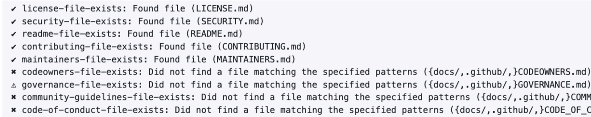

# DSAC OSPO Outbound Review Checklist
## Tier 3: Public Repository
### Instructions
This is a review process to approve CMS-developed software to be released open source.
If you would like your repository to be released, please complete the following steps.

[Instructions](#instructions)

[State the Benefits of Open Sourcing the Project](#state-the-benefits-of-open-sourcing-the-project)

[State the Risks of Open Sourcing the Project](#state-the-risks-of-open-sourcing-the-project)

[Questions](#questions)

[Code Review](#code-review)

[Code Analysis](#code-analysis)

[Toolkit](#toolkit)

[Review Licensing](#review-licensing)

[Review Commit History](#review-commit-history)

[Review Repository Hygiene](#review-repository-hygiene)

[Review Repository Details](#review-repository-details)

[Additional Notes & Questions](#additional-notes--questoins)

[Sign off on risk acceptance of open-sourcing the software product](#sign-off-on-risk-acceptance-of-open-sourcing-the-software-product)

[Flipping the Switch: Making the Repository Public](#flipping-the-switch-making-the-repository-public)


### State the Benefits of Open Sourcing the Project

- [ ] **Cost Savings**

    By making the project freely available, this reduces licensing and acquisition costs.

- [ ] **Ease of Repurposing**

    The open nature of the code allows users to modify and adapt the software to suit their
    specific needs, fostering customization and flexibility.

- [ ] **Minimization of Vendor Lock-in/Flexibility of Vendor Choice**

    Users are not tied to a single vendor, providing the freedom to choose between different vendors.

- [ ] **Enable Transparency**

    The source code is accessible and visible to anyone, promoting transparency in how the
    software functions, which helps build trust.

- [ ] **Enable extension/extensibility**

    Users can extend and enhance the functionality of the software by adding their own
    features.

- [ ] **Increase Interoperability**

    Planning in the open enables future compatibility and interoperability between different
    systems and software applications.

- [ ] **Facilitate Experimentation/Early Adoption**

    Working in the open encourages experimentation and early adoption of cutting-edge
    technologies, leading to faster innovation and improvement in software capabilities.


### State the Risks of Open Sourcing the Project

- [ ] **Security Risks**

    Vulnerabilities may be exposed if the code is not thoroughly reviewed, potentially leading to security breaches or exploitation. (See: [SECURITY.md]({{cookiecutter.project_slug}}/SECURITY.md)) Does this project connect to any CMS-internal only systems? Does this project require authorization or authentication to operate? Does this project detail any non-public directories of CMS/HHS systems or people?

- [ ] **Financial Risks**

    Costs may arise from: 
    Maintaining code, community engagement, addressing security concerns, subscription costs hardware costs, specialized tooling or infrastructure costs. Does this project require any ongoing financial costs or subscription fees? (e.g., Cloud Hosting, Specialized build systems, paid maintainers, paid libraries or dependencies.)

- [ ] **Privacy Risks**

    Does this project require access to non-public, non-synthetic PII, PHI, or other internal-only CMS systems containing such data or information?


### Questions

- **Does the code contain or touch any private information such as Personal Identifiable Information (PII) or Protected Health Information (PHI)?**
  - Can it be removed? Is it absolutely needed to function? Can it be shipped with synthetic data instead?

- **Does the code interface with any of CMS’ internal-only systems (e.g. mainframes, JIRA instances, databases, etc…)?**

- **Does the repository contain any keys or credentials to access or authenticate with CMS’ systems?**
  - Can it be removed or is it needed?

If you answered “yes” to any of the above questions, your project may be ‘sensitive’ in nature and require a more thorough review before sharing publicly. Please reach out to [opensource@cms.hhs.gov](mailto:opensource@cms.hhs.gov) for guidance. If you answer yes to any of these questions above, it is best to NOT open source the product due to security reasons.

#### Results
*Insert Review Here*


### Code Review
The existing codebase should be given a one time, top-to-bottom code quality and
security vulnerability review by two (or more) engineers who have written
production code within the past two years, in the languages used in the project.
Engineers should review credential management practices with the development
team to ensure that any keys, passwords, or other sensitive configurations are not
checked into source code or in the git history. 

The engineers can be federal government employees or trusted partners from
outside the agency from other contracts, or from independent testing contracts.
Their names, organizations, comments and approval/disapproval on the overall
codebase should be tracked in this document.

To provide independent review, the engineers should not have been involved in the
development of the software product. This includes engineers who wrote part of
the software or who directly provided technical direction and oversight in the
creation of the software.

As part of the code review, engineers should reference modern listings of the most
significant software security vulnerabilities. For instance, an acceptable description
would be that the engineers showed how they used automated tools and manual
review to check each item in [OWASP's current 10 Most Critical Web Application
Security Risks](https://owasp.org/www-project-top-ten/).

#### Results
*Insert Review Here*


### Code Analysis

At least one automated tool for code analysis (such as static code analysis tools) has been
run on the codebase to look for security vulnerabilities, and results have been
appropriately acted upon. Even if all findings are eventually fixed, if the initial scans
revealed significant, severe vulnerabilities (such as SQL injection vulnerabilities), this
indicates that the software development team may not be adhering to the best practices
required for open source public release.

Automated tooling for code analysis should be incorporated as a regularly scheduled part
of the application development process. The development team should briefly document
how frequently they commit to running these automated scanning tools, and who will be
running the tests, interpreting, and acting upon the results.


### Toolkit

Below is a list of suggested tools to run for code analysis:

| Tool | Description | Link |
|------|-------------|------|
|Repo Linter| Lint repositories for common issues such as missing files,etc...| https://github.com/todogroup/repolinter|
| Gitleaks | Protect and discover secrets using Gitleaks🔑 | https://github.com/gitleaks/gitleaks |
| git filter-repo    | Entirely remove unwanted files / files with sensitive data from a repository's history | https://docs.github.com/en/authentication/keeping-your-account-and-data-secure/removing-sensitive-data-from-a-repository |

#### Results
*Insert Review Here*


### Review Licensing

Ensure that acceptable licensing is decided for the project. Most often, software released
as open source by the federal government does so under the Creative Commons Zero 1.0
license.

Suggested licensing:

 **Public Domain**

 - This project is in the public domain within the United States, and copyright and related rights in the work worldwide are waived through the CC0 1.0 Universal public domain dedication.

 - All contributions to this project will be released under the CC0 dedication. By submitting a pull request, you are agreeing to comply with this waiver of copyright interest.

#### Results
*Insert Review Here*


### Review Commit History

Review the history of commits to the version control system used, and whether the team
prefers to clean (e.g., rebase) this history before releasing to the public.

If not rebasing, verify that:
1. There are no obscene or impolite remarks in comments or commit history
2. There are no sensitive internal URLs/IP Addresses in comments or commit history
3. There are no credential files such as Passwords, API/SSH/GPG keys checked into
the repo.

Consider using the following tools to perform the tasks above:

 Tool | Description | Link |
|------|-------------|--------------------|
| gitleaks | Open source tool that detects and prevents secrets (passwords/api/ssh keys) checked-in to your git repo | https://github.com/gitleaks/gitleaks <br> [What is git leaks and how to use it?](https://akashchandwani.medium.com/what-is-gitleaks-and-how-to-use-it-a05f2fb5b034) |
| git filter-repo | Entirely remove unwanted files / files with sensitive data from a repository's history | https://docs.github.com/en/authentication/keeping-your-account-and-data-secure/removing-sensitive-data-from-a-repository |

#### Results
*Insert Review Here*


### Review Repository Hygiene
As part of our repository hygiene requirements, the project must include certain files and
sections. Using repolinter will help you identify missing files and content that will need to
be added to your repository before outbounding.

#### Running repolinter on your repository locally
1. Add [repolinter.json](https://github.com/DSACMS/repo-scaffolder/blob/main/tier3/%7B%7Bcookiecutter.project_slug%7D%7D/repolinter.json) to the root directory of your project
2. Run command: 
```
repolinter lint

```
3. The result produces a list of file and section existence checks, indicating whether
each requirement was met or not.



#### Running repolinter on your repository via GitHub Actions**
1. Add the tier-specific [checks.yml](https://github.com/DSACMS/repo-scaffolder/blob/main/tier3/%7B%7Bcookiecutter.project_slug%7D%7D/.github/workflows/checks.yml) to the .github directory of your project. The file
includes a job that runs a repolinter called [repolinter-checks](https://github.com/DSACMS/repo-scaffolder/blob/4d48f831bc21534d599817e98130fa7956e4282b/tier3/%7B%7Bcookiecutter.project_slug%7D%7D/.github/workflows/checks.yml#L13).
2. Manually trigger the workflow.
3. The result produces an issue on the repository with a list of file and section
existence checks, indicating whether each requirement was met or not.

#### Review Content

The project should include the following files and sections [(link to templates)](https://github.com/DSACMS/repo-scaffolder/tree/main/tier3/%7B%7Bcookiecutter.project_slug%7D%7D):

- [ ] README.md

    *An essential guide that gives viewers a detailed description of your project*

| Section                        | Description                                                                                                                                                                                                                                                                                       | Included               |
|-------------------------------|---------------------------------------------------------------------------------------------------------------------------------------------------------------------------------------------------------------------------------------------------------------------------------------------------|----------|
| Project Description            | 1-3 sentence short description of the project that can be used as a 'one-liner' to describe the repo. A best practice is using this same language as the official 'description' on a GitHub repo landing page.                                                                                 | ✅  ❌    |
| About the Project              | Longer-form description of the project. It can include history, background, details, problem statements, links to design documents or other supporting materials, or any other information/context that a user or contributor might be interested in.                                          |       |
| Core Team                     | This information helps with succession planning and provenance for security compliance and remediation. It helps future users and contributors understand where the code originated.                                                                                                         |          |
| Documentation Index            | This is like a 'table of contents' for your documentation. Tier 0/1 projects with simple README.md files without many sections may or may not need this, but it is still extremely helpful to provide "bookmark" or "anchor" links to specific sections of your file to be referenced in tickets, docs, or other communication channels. |          |
| Repository Structure           | Using the "tree" command can be a helpful way to generate this information, but, be sure to update it as the project evolves and changes over time.                                                                                                                                              |          |
| Development and Software Delivery Lifecycle | | |
| Local Development| Use step by step instructions to get from 'zero' to 'running code.' Should include any system libraries or packages that are a 'pre-requisite' to installation of your project. When possible, including install instructions for multiple Operating Systems (or being explicit about which operating system the project was developed on) is a recommended practice. |          |
| Code Style & Linters | This section outlines best practices contributors should follow to reduce friction and improve readability, functionality, and quality of contributions to a project. Oftentimes, these checks can be automated and run as part of a continuous integration and deployment pipeline. | |
| Branching Model        | Branching models (such as git flow) are recommended as a best practice for keeping feature development history clear, and to help reinforce development best practices.                             |                  |
| Contributing           | For projects that accept contributions, point towards the CONTRIBUTING.md file.   |                  |
| Codeowners             | Though all tiers have an 'implied' code-owner, since there is at least one author of the repo, explicit is better than implicit. In the case that a project may outlive the original author, a shared inbox or alias is recommended for longer-lived projects (e.g. opensource@cms.hhs.gov). |                  |
| Community              | Point your contributors towards wherever your community exists (e.g. email lists, online discussion boards or channels, project backlogs and documentation, etc.).                                 |                  |
| Community Guidelines    | This section points to a CODE_OF_CONDUCT.md file or website providing information around acceptable conduct and reporting mechanisms and escalation strategies. It is better to have these processes defined before they are needed, so you can focus on support if/when there is an incident (e.g. Contributor-covenant.org). |                  |
| Feedback               | Direct users towards the channel where they're encouraged to provide feedback, typically a github.com/$REPO/issue/new URL.         |                  |
| Policies               | This section is to explicitly link to Federal policies and guidelines that are required or recommended for Federal projects to comply with, such as Accessibility (508), Interoperability, Anti-deficiency, Security, Licensing, and other policies that can vary between agencies and domains. |                  |
| Public Domain          | A best practice is to list the LICENSE under which a project is released at the bottom of the README. In most cases for Federal repos, we default to Creative Commons Zero 1.0 International (world-wide public domain). |                  |

- [ ] LICENSE

    *License of your project, whether public domain (CC0) or other OSI-approved License. Using
    ‘vanilla’ license text will allow for GitHub to auto-label the license information on the
    repository landing page.*

- [ ] CONTRIBUTING.md

    *Provides guidance on how users can run your project and make contributions to it*

| Section                     | Description                                                                                                          | Included |
|-----------------------------|----------------------------------------------------------------------------------------------------------------------|----------|
| How to Contribute           | Basic instructions about where to send patches, check out source code, and get development support.                  | ✅  ❌        |
| Getting Started             | Includes installation steps, prerequisites for installation, and instructions for working with the source code.      |      |
| Team Specific Guidelines     | This section helps contributors understand any team structure in the project (formal or informal). Encouraged to point towards the MAINTAINERS.md file for further details. |          |
| Building dependencies        | This step is often skipped, so don't forget to include the steps needed to install on your platform. If your project can be multi-platform, this is an excellent place for first time contributors to send patches. |          |
| Building the Project        | Be sure to include build scripts and instructions, not just the source code itself!                                 |          |
| Workflow & Branching        | If your project has a preferred workflow or branching structure, mention it here. We recommend 'git flow' as a good default. |          |
| Testing Conventions         | Discuss where tests can be found, how they are run, and what kind of tests/coverage strategy and goals the project has. |          |
| Coding Style + Linters      | HIGHLY ENCOURAGED. Specific tools will vary between different languages/frameworks (e.g. Black for Python, eslint for JavaScript, etc.). |          |
| Writing Issues              | Make a brief statement about where to file issues, and conventions for doing so. Link to ISSUE_TEMPLATE.md file.    |          |
| Writing Pull Requests       | Make a brief statement about where to file pull/merge requests, and conventions for doing so. Link to PULL_REQUEST_TEMPLATE.md file. |          |
| Code Review                 | Make a brief statement about how pull requests are reviewed, and who is doing the reviewing. Linking to MAINTAINERS.md can help. |          |
| Documentation Updates       | Where is the documentation hosted? How is it updated? Who updates it?                                               |          |
| Policies                    | This section is here to explicitly link to Federal policies and guidelines that are required or recommended for Federal projects to comply with, such as Accessibility (508), Interoperability, Anti-deficiency, Security, Licensing, and other policies that can vary between agencies and domains. |          |
| Public Domain               | This section is to explicitly link to Federal policies and guidelines that are required or recommended for Federal projects to comply with, such as Accessibility (508), Interoperability, Anti-deficiency, Security, Licensing, and other policies that can vary between agencies and domains. |          |


- [ ] **CODEOWNERS.md**

    *Specifies code ownership and reviewers*

- [ ] **MAINTAINERS.md**

    *Lists project maintainers and their responsibilities*

- [ ] **GOVERNANCE.md**

    *Outlines project governance structure and processes*

- [ ] **CODE_OF_CONDUCT.md**

    *Defines the code of conduct for contributors*

- [ ] **COMMUNITY_GUIDELINES.md**

    *Provides guidelines for community participation*

- [ ] **SECURITY.md**

    *Details security policies and procedures*

- [ ] **repolinter.json**

    *Lints repository for missing files and sections above*

#### Results
*Insert Review Here*


### Review Repository Details
The GitHub repository homepage features a concise description of the project, a list of
relevant topic tags, and general information about the repository to provide a
comprehensive overview for users and contributors.

**About Section:**

- [ ] Description
 
    *1-2 sentences describing the project*

- [ ] Website

    *Link to project’s website*

- [ ] Topics

    *Tags for project discoverability. Helpful topics to classify a repository include the
        repository's intended purpose, subject area, community, or language.*


**Include in Home Page:**
- [ ] Releases
- [ ] Packages
- [ ] Deployments


#### Results
*Insert Review Here*


### Additional Notes & Questoins
*Insert any notes or questions here*


### Sign off on risk acceptance of open-sourcing the software product
After reviewing the materials prepared by the team that is working to open source the product,
the business owner signs off on a risk acceptance for open-sourcing the software product.

Requesting sign off from key people on this request.

| Reviewer Organization    | Reviewer Names                        | Reviewer’s Recommendation       |
|--------------------------|---------------------------------------|----------------------------------|
| Code Reviewer 's Reccommendation           | CODE REVIEWER 1 <br> CODE REVIEWER 2 <br> CODE REVIEWER 3 | [Approved/Needs Approval] <br> [Approved/Needs Approval] <br> [Approved/Needs Approval]       |
| ISSO                     | ISSO REVIEWER                        | [Approved/Needs Approval]       |
| ISG Technical Approval    | ISG REVIEWER                         | [Approved/Needs Approval]       |
| Business Owner(s)       | BUSINESS OWNER 1 </n> BUSINESS OWNER 2   | [Approved/Needs Approval] </n> [Approved/Needs Approval]     |


### Flipping the Switch: Making the Repository Public
Once the repository has passed outbound review, we are ready to “flip the switch” and
officially make it public. Once made public, there are a couple of actions that need to be
taken:

#### Repository Actions

Please enable the following features to enhance repository security and maintain code
quality:

- [ ] Dependabot Alerts

    *A GitHub Feature. Get notified when one of your dependencies has a vulnerability*

- [ ] Secret Scanning Alerts

    *A GitHub Feature. Get notified when a secret is pushed to this repository. Ideally set this up to run after each new commit is pushed to the Repository.*

- [ ] Branch Protections

    *Ensures the integrity of important branches by preventing unauthorized actions like force pushes and requiring pull request reviews with specific checks before merging. Dev and main should be protected branches in the repository.*

- [ ] Git Branching

    *After making the repository public, make sure there is a coherent git branching plan in place. For example: agree to merge feature related pull requests into dev but merge bug fixes into main instead of dev first.*

- [ ] Add Repolinter GH Action to CI

    *For ongoing adherence to repository hygiene standards, integrate the repolinter GitHub Action into your CI pipeline. This addition enhances your workflow by automatically enforcing repository cleanliness standards.*

- [ ] Optional: DCO (Developer Certificate of Origin)

    *Requires all commit messages to contain the Signed-off-by line with an email address that matches the commit author. The Developer Certificate of Origin (DCO) is a lightweight way for contributors to certify that they wrote or otherwise have the right to submit the code they are contributing to the project. The GitHub app to enforce DCO can be found [here](https://github.com/apps/dco) .*


#### Communications & Rollout 📣

Share the good news with communities both inside and outside CMS!

- [ ] Draft a launch announcement

    *Be sure to include the following information:*
 - Repo Description
 - Repo URL
 - Authoring Team Email Contact
 - Authoring Team URL
 - Authorting Team Slack Channel
 - Call to action (file issues, contribute PRs)
- [ ] Post launch announcement to CMS slack channels
 - #cms-opensource
 - #cms-api-community
 - #cms-data-community
 - #cms-engineering-community
 - #ai-community
- [ ] Send a launch announcement email
- [ ] Add launch announcement to a Confluence Wiki Page

#### Tracking 📈

Add your project to our inventories.

- [ ] Add to https://github.com/dsacms/open projects inventory
- [ ] Add code.json to repository and sent over a pull request to code.gov