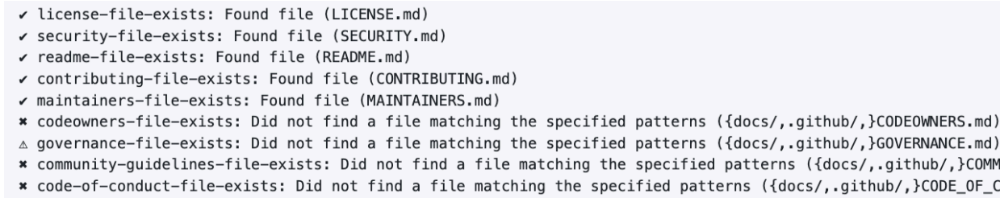

# CMS OSPO Outbound Review Checklist

## Tier 4: Community Governance

### Instructions

This is a review process to approve CMS-developed software to be released open source.
If you would like your repository to be released, please complete the following steps.

[Prerequisites](#prerequisites)

[State the Benefits of Open Sourcing the Project](#state-the-benefits-of-open-sourcing-the-project)

[State the Risks of Open Sourcing the Project](#state-the-risks-of-open-sourcing-the-project)

[Questions](#questions)

[Code Review](#code-review)

[Code Analysis](#code-analysis)

[Review Licensing](#review-licensing)

[Review Commit History](#review-commit-history)

[Review Repository Hygiene](#review-repository-hygiene)

[Review Project Metadata](#review-project-metadata)

[Review Repository Details](#review-repository-details)

[Review OpenSSF Scorecard](#review-openssf-scorecard)

[Additional Notes & Questions](#additional-notes--questions)

[Sign off on risk acceptance of open-sourcing the software product](#sign-off-on-risk-acceptance-of-open-sourcing-the-software-product)

[Flipping the Switch: Making the Repository Public](#flipping-the-switch-making-the-repository-public)

### Prerequisites
**Your project should be stored in a GitHub repository**
If you are new to GitHub or repositories, checkout the OSPO's [Beginner Guide to Creating GitHub Repos](https://dsacms.github.io/ospo-guide/resources/beginner-guide-github-repos/) before moving on to the next steps.

Does your repository align with the requirements of a Tier 4 project? To verify:

- Review the flowchart or use `tier-determiner.py` provided in the [README.md](https://github.com/DSACMS/repo-scaffolder?tab=readme-ov-file#need-help-picking-a-maturity-tier).
- Read more about [Tier 4](https://github.com/DSACMS/repo-scaffolder/tree/main/tier4) and the overall [CMS OSPO maturity model framework](https://github.com/DSACMS/repo-scaffolder/blob/main/maturity-model-tiers.md).

#### Results

_Insert Review Here_

### State the Benefits of Open Sourcing the Project

- [ ] **Cost Savings**

  By making the project freely available, this reduces licensing and acquisition costs.

- [ ] **Ease of Repurposing**

  The open nature of the code allows users to modify and adapt the software to suit their
  specific needs, fostering customization and flexibility.

- [ ] **Minimization of Vendor Lock-in/Flexibility of Vendor Choice**

  Users are not tied to a single vendor, providing the freedom to choose between different vendors.

- [ ] **Enable Transparency**

  The source code is accessible and visible to anyone, promoting transparency in how the
  software functions, which helps build trust.

- [ ] **Enable extension/extensibility**

  Users can extend and enhance the functionality of the software by adding their own
  features.

- [ ] **Increase Interoperability**

  Planning in the open enables future compatibility and interoperability between different
  systems and software applications.

- [ ] **Facilitate Experimentation/Early Adoption**

  Working in the open encourages experimentation and early adoption of cutting-edge
  technologies, leading to faster innovation and improvement in software capabilities.

### State the Risks of Open Sourcing the Project

- [ ] **Security Risks**

  Vulnerabilities may be exposed if the code is not thoroughly reviewed, potentially leading to security breaches or exploitation. (See: [SECURITY.md]({{cookiecutter.project_slug}}/SECURITY.md)) Does this project connect to any CMS-internal only systems? Does this project require authorization or authentication to operate? Does this project detail any non-public directories of CMS/HHS systems or people?

- [ ] **Financial Risks**

  Costs may arise from maintaining code, community engagement, addressing security concerns, subscription costs hardware costs, specialized tooling or infrastructure costs. Does this project require any ongoing financial costs or subscription fees? (e.g., Cloud Hosting, Specialized build systems, paid maintainers, paid libraries or dependencies.)

- [ ] **Privacy Risks**

  Does this project require access to non-public, non-synthetic PII, PHI, or other internal-only CMS systems containing such data or information?

### Questions

- Does the code contain or touch any private information such as Personal Identifiable Information (PII) or Protected Health Information (PHI)?

  - Can it be removed? Is it absolutely needed to function? Can it be shipped with synthetic data instead?

- Does the code interface with any of CMS’ internal-only systems (e.g. mainframes, JIRA instances, databases, etc…)?

- Does the repository contain any keys or credentials to access or authenticate with CMS’ systems?
  - Can it be removed or is it needed?

If you answered “yes” to any of the above questions, your project may be ‘sensitive’ in nature and require a more thorough review before sharing publicly. Please reach out to [opensource@cms.hhs.gov](mailto:opensource@cms.hhs.gov) for guidance. If you answer yes to any of these questions above, it is best to NOT open source the product due to security reasons.

#### Results

_Insert Review Here_

### Code Review

The existing codebase should be given a one time, top-to-bottom code quality and
security vulnerability review by two (or more) engineers who have written
production code within the past two years, in the languages used in the project.
Engineers should review credential management practices with the development
team to ensure that any keys, passwords, or other sensitive configurations are not
checked into source code or in the git history.

The engineers can be federal government employees or trusted partners from
outside the agency from other contracts, or from independent testing contracts.
Their names, organizations, comments and approval/disapproval on the overall
codebase should be tracked in this document.

To provide independent review, the engineers should not have been involved in the
development of the software product. This includes engineers who wrote part of
the software or who directly provided technical direction and oversight in the
creation of the software.

As part of the code review, engineers should reference modern listings of the most
significant software security vulnerabilities. For instance, an acceptable description
would be that the engineers showed how they used automated tools and manual
review to check each item in [OWASP's current 10 Most Critical Web Application
Security Risks](https://owasp.org/www-project-top-ten/).

#### Results

_Insert Review Here_

### Code Analysis

At least one automated tool for code analysis (such as static code analysis tools) has been
run on the codebase to look for security vulnerabilities, and results have been
appropriately acted upon. Even if all findings are eventually fixed, if the initial scans
revealed significant, severe vulnerabilities (such as SQL injection vulnerabilities), this
indicates that the software development team may not be adhering to the best practices
required for open source public release.

Automated tooling for code analysis should be incorporated as a regularly scheduled part
of the application development process. The development team should briefly document
how frequently they commit to running these automated scanning tools, and who will be
running the tests, interpreting, and acting upon the results.

#### Toolkit

Below is a list of suggested tools to run for code analysis:

| Tool            | Description                                                                            | Link                                                                                                                                                                                                                          |
| --------------- | -------------------------------------------------------------------------------------- | ----------------------------------------------------------------------------------------------------------------------------------------------------------------------------------------------------------------------------- |
| Repo Linter     | Lint repositories for common issues such as missing files,etc...                       | https://github.com/todogroup/repolinter                                                                                                                                                                                       |
| Gitleaks        | Protect and discover secrets using Gitleaks 🔑                                         | https://github.com/gitleaks/gitleaks <br /> Use and run [gitleaks.yml](https://github.com/DSACMS/repo-scaffolder/blob/main/tier4/%7B%7Bcookiecutter.project_slug%7D%7D/.github/workflows/gitleaks.yml) provided in repository |
| git filter-repo | Entirely remove unwanted files / files with sensitive data from a repository's history | https://docs.github.com/en/authentication/keeping-your-account-and-data-secure/removing-sensitive-data-from-a-repository                                                                                                      |
| bulk_extractor  | Check for secrets, URLs, emails, etc.                                                  | [bulk_extractor Official Documentation](https://github.com/simsong/bulk_extractor) <br> [OSPO Guide Documentation](https://github.com/DSACMS/ospo-guide/blob/main/outbound/bulk_extractor.md)                                 |
| Wiz _(Optional)_  | Cloud security platform for vulnerability scanning and code analysis; recommended for large scale projects | https://www.wiz.io/    

#### Results

_Insert Review Here_

### Review Licensing

Ensure that acceptable licensing is decided for the project. Most often, software released as open source by the federal government does so under the Creative Commons Zero 1.0
license.

Suggested licensing:

**Public Domain**

This project is in the public domain within the United States, and copyright and related rights in the work worldwide are waived through the CC0 1.0 Universal public domain dedication.

All contributions to this project will be released under the CC0 dedication. By submitting a pull request, you are agreeing to comply with this waiver of copyright interest.

If your project is not being dedicated to the public domain under CC0, due to being work for hire, or some other documented reason, then choosing another [OSI approved license](https://opensource.org/license) is the next best thing.

#### Results

_Insert Review Here_

### Review Commit History

Review the history of commits to the version control system used, and whether the team
prefers to clean (e.g., rebase) this history before releasing to the public.

If not rebasing, verify that:

1. There are no obscene or impolite remarks in comments or commit history
2. There are no sensitive internal URLs/IP Addresses in comments or commit history
3. There are no credential files such as Passwords, API/SSH/GPG keys checked into
   the repo.

Consider using the following tools to perform the tasks above:

| Tool            | Description                                                                                             | Link                                                                                                                                                                                                                                                                                                                                                         |
| --------------- | ------------------------------------------------------------------------------------------------------- | ------------------------------------------------------------------------------------------------------------------------------------------------------------------------------------------------------------------------------------------------------------------------------------------------------------------------------------------------------------ |
| gitleaks        | Open source tool that detects and prevents secrets (passwords/api/ssh keys) checked-in to your git repo | https://github.com/gitleaks/gitleaks <br> [What is git leaks and how to use it?](https://akashchandwani.medium.com/what-is-gitleaks-and-how-to-use-it-a05f2fb5b034) <br /> Use and run [gitleaks.yml](https://github.com/DSACMS/repo-scaffolder/blob/main/tier4/%7B%7Bcookiecutter.project_slug%7D%7D/.github/workflows/gitleaks.yml) provided in repository |
| git filter-repo | Entirely remove unwanted files / files with sensitive data from a repository's history                  | https://docs.github.com/en/authentication/keeping-your-account-and-data-secure/removing-sensitive-data-from-a-repository                                                                                                                                                                                                                                     |
| bulk_extractor  | Check for secrets, URLs, emails, etc.                                                                   | [bulk_extractor Official Documentation](https://github.com/simsong/bulk_extractor) <br> [OSPO Guide Documentation](https://github.com/DSACMS/ospo-guide/blob/main/outbound/bulk_extractor.md)                                                                                                                                                                |

#### Results

_Insert Review Here_

### Review Repository Hygiene

As part of our repository hygiene requirements, the project must include certain files and
sections. Using repolinter will help you identify missing files and content that will need to
be added to your repository before outbounding.

#### Running repolinter on your repository locally

1. Add [repolinter.json](https://github.com/DSACMS/repo-scaffolder/blob/main/tier4/%7B%7Bcookiecutter.project_slug%7D%7D/repolinter.json) to the root directory of your project

2. Run command:

```
repolinter lint

```

3. The result produces a list of file and section existence checks, indicating whether each requirement was met or not.



#### Running repolinter on your repository via GitHub Actions

1. Add the tier-specific [repoHygieneCheck.yml](https://github.com/DSACMS/repo-scaffolder/blob/main/tier4/%7B%7Bcookiecutter.project_slug%7D%7D/.github/workflows/repoHygieneCheck.yml) to the github directory of your project. The file includes a job that runs repolinter called [repolinter-checks](https://github.com/DSACMS/repo-scaffolder/blob/main/tier4/%7B%7Bcookiecutter.project_slug%7D%7D/.github/workflows/repoHygieneCheck.yml#L56)

2. Manually trigger the workflow.

3. The result produces an issue on the repository with a list of file and section existence checks, indicating whether each requirement was met or not.

#### Review Content

The project should include the following files and sections [(link to templates)]({{cookiecutter.project_slug}}):

- [ ] **LICENSE**

  _License of your project, whether public domain (CC0) or other OSI-approved License. Using
  ‘vanilla’ license text will allow for GitHub to auto-label the license information on the
  repository landing page._

- [ ] **code.json**

  _Contains metadata about the project, refer to [Review Project Metadata](#review-project-metadata)_

- [ ] **README.md**

  _An essential guide that gives viewers a detailed description of your project_

| Section                                     | Description                                                                                                                                                                                                                                                                                                                    | Included? |
| ------------------------------------------- | ------------------------------------------------------------------------------------------------------------------------------------------------------------------------------------------------------------------------------------------------------------------------------------------------------------------------------ | --------- |
| Project Description                         | This should be 1-3 sentence short description of the project that can be used as a 'one-liner' to describe the repo. A best practice is using this same language as the official 'description' on a GitHub repo landing page.                                                                                                  | ✅ ❌     |
| About the Project                           | This should be a longer-form description of the project. It can include history, background, details, problem statements, links to design documents or other supporting materials, or any other information/context that a user or contributor might be interested in.                                                         |           |
| Project Vision                              | This should be a forward-looking statement that outlines the desired future state or long-term goals of the project.                                                                                                                                                                                                           |           |
| Project Mission                             | This should be a statement that defines the purpose, scope, and specific objectives of the project.                                                                                                                                                                                                                            |           |
| Agency Mission                              | Agency-led projects should include information about their agency mission. This should be taken directly from agency websites or wikis.                                                                                                                                                                                        |           |
| Team Mission                                | Agency-led projects should include information about the team executing on the mission. This should be taken directly from internal team charters and functional statements.                                                                                                                                                   |           |
| Core Team                                   | This information helps with succession planning and provenance for security compliance and remediation. It helps future users and contributors understand where the code originated.                                                                                                                                           |           |
| Repository Structure                        | Including the repository structure helps viewers quickly understand the project layout. It is also helpful to include a 'table of contents" for your documentation, providing "bookmark" or "anchor" links to specific sections of your file to be referenced in tickets, docs, or other communication channels.               |           |
| Development and Software Delivery Lifecycle | Outlines the stages, practices, and tools used in developing, testing, and delivering the software.                                                                                                                                                                                                                            |           |
| Local Development                           | Use step by step instructions to get from 'zero' to 'running code.'                                                                                                                                                                                                                                                            |           |
| Coding Style and Linters                    | Best practices contributors should follow to reduce friction and improve readability, functionality, and quality of contributions.                                                                                                                                                                                             |           |
| Branching Model                             | Branching models (such as git flow) are recommended as a best practice for keeping feature development history clear, and to help reinforce development best practices.                                                                                                                                                        |           |
| Contributing                                | For projects that accept contributions, point towards the CONTRIBUTING.md file.                                                                                                                                                                                                                                                |           |
| Community                                   | Point your contributors towards wherever your community exists (e.g. email lists, online discussion boards or channels, project backlogs and documentation, etc.).                                                                                                                                                             |           |
| Community Guidelines                        | This section points to a CODE_OF_CONDUCT.md file or website providing information around acceptable conduct and reporting mechanisms and escalation strategies. It is better to have these processes defined before they are needed, so you can focus on support if/when there is an incident (e.g. Contributor-covenant.org). |           |
| Governance                                  | Make a short statement about how the project is governed (formally, or informally) and link to the GOVERNANCE.md file.                                                                                                                                                                                                         |           |
| Feedback                                    | Direct users towards the channel where they're encouraged to provide feedback, typically a github.com/$REPO/issue/new URL.                                                                                                                                                                                                     |           |
| Glossary                                    | Good candidate content includes any project-specific acronyms (esp applicable for Government projects) and any critical Subject Matter Expertise related vocabulary for people who are new to the domain your project is within.                                                                                               |           |
| Policies                                    | This section is to explicitly link to Federal policies and guidelines that are required or recommended for Federal projects to comply with, such as Accessibility (508), Interoperability, Anti-deficiency, Security, Licensing, and other policies that can vary between agencies and domains.                                |           |
| Public Domain                               | A best practice is to list the LICENSE under which a project is released at the bottom of the README. In most cases for Federal repos, we default to Creative Commons Zero 1.0 International (world-wide public domain).                                                                                                       |           |

- [ ] **COMMUNITY.md**

  _Outlines the community members, roles, responsibilities, and guidelines for participating in the project._

| Section                  | Description                                                                                                                                                                                                                                                                                                         | Included |
| ------------------------ | ------------------------------------------------------------------------------------------------------------------------------------------------------------------------------------------------------------------------------------------------------------------------------------------------------------------- | -------- |
| Table of Project Members | Who are the points of contact in your project who are responsible/accountable for the project? This can often be an engineering or design manager or leader, who may or may not be the primary maintainers of the project.                                                                                          | ✅ ❌    |
| Responsibilities & Roles | Defines the key members of the project team, their responsibilities, and how they help steer the project's growth and success. the                                                                                                                                                                                  |          |
| Maintainers List         | Who are the project maintainers? List out @USERNAMES where possible so they can be tagged in issues/PRs directly.                                                                                                                                                                                                   |          |
| Approvers List           | Who are the project approvers? List out @USERNAMES where possible so they can be tagged in issues/PRs directly.                                                                                                                                                                                                     |          |
| Reviewers List           | Who are the project reviewers? List out @USERNAMES where possible so they can be tagged in issues/PRs directly.                                                                                                                                                                                                     |          |
| Contributors             | Who has contributed to the project? Highlight and credit the users who have contributed to the repository.                                                                                                                                                                                                          |          |
| Alumni                   | Who are the past maintainers or contributors who previously played significant roles in this project who are no longer actively involved? Consider including their roles and dates for context.                                                                                                                     |          |
| Principles               | This section communicates to prospective contributors and users what the values of your community are. The examples provided in the template were established by the Justice40 project at USDS.                                                                                                                     |          |
| Community Guidelines     | This section communicates specific norms and guidelines for how to participate and contribute positively to your community. The more explicit you can be about behaviors you'd like to encourage or discourage, the less friction new contributors will experience in onboarding and operating within your project. |          |
| Acknowledgements         | This section recognizes previous work and best practices established by the other members of the federal open source community such as USDS, GSA, 18F, and the Justice40 Project.                                                                                                                                   |          |

- [ ] **CONTRIBUTING.md**

  _Provides guidance on how users can run your project and make contributions to it_

| Section                  | Description                                                                                                                                                                                                                                                                                                            | Included |
| ------------------------ | ---------------------------------------------------------------------------------------------------------------------------------------------------------------------------------------------------------------------------------------------------------------------------------------------------------------------- | -------- |
| How to Contribute        | Basic instructions about where to send patches, check out source code, and get development support.                                                                                                                                                                                                                    | ✅ ❌    |
| Getting Started          | Includes installation steps, prerequisites for installation, and instructions for working with the source code.                                                                                                                                                                                                        |          |
| Team Specific Guidelines | This section helps contributors understand any team structure in the project (formal or informal). Encouraged to point towards the COMMUNITY.md file for further details.                                                                                                                                              |          |
| Building dependencies    | This step is often skipped, so don't forget to include the steps needed to install on your platform. If your project can be multi-platform, this is an excellent place for first time contributors to send patches.                                                                                                    |          |
| Building the Project     | Be sure to include build scripts and instructions, not just the source code itself!                                                                                                                                                                                                                                    |          |
| Workflow and Branching   | If your project has a preferred workflow or branching structure, mention it here. We recommend 'git flow' as a good default.                                                                                                                                                                                           |          |
| Testing Conventions      | Discuss where tests can be found, how they are run, and what kind of tests/coverage strategy and goals the project has.                                                                                                                                                                                                |          |
| Coding Style and Linters | HIGHLY ENCOURAGED. Specific tools will vary between different languages/frameworks (e.g. Black for Python, eslint for JavaScript, etc.).                                                                                                                                                                               |          |
| Writing Issues           | Make a brief statement about where to file issues, and conventions for doing so. Link to ISSUE_TEMPLATE.md file.                                                                                                                                                                                                       |          |
| Writing Pull Requests    | Make a brief statement about where to file pull/merge requests, and conventions for doing so. Link to PULL_REQUEST_TEMPLATE.md file.                                                                                                                                                                                   |          |
| Reviewing Pull Requests  | Make a brief statement about how pull requests are reviewed, and who is doing the reviewing. Linking to COMMUNITY.md can help.                                                                                                                                                                                         |          |
| Shipping Releases        | What cadence does your project ship new releases? (e.g. one-time, ad-hoc, periodically, upon merge of new patches) Who does so? Using the [release-guidelines-template.md](https://github.com/DSACMS/repo-scaffolder/blob/main/release-guidelines-template.md) can assist with developing and documenting the process. |          |
| Documentation Updates    | Where is the documentation hosted? How is it updated? Who updates it?                                                                                                                                                                                                                                                  |          |
| Policies                 | This section is here to explicitly link to Federal policies and guidelines that are required or recommended for Federal projects to comply with, such as Accessibility (508), Interoperability, Anti-deficiency, Security, Licensing, and other policies that can vary between agencies and domains.                   |          |
| Public Domain            | This section is to explicitly link to Federal policies and guidelines that are required or recommended for Federal projects to comply with, such as Accessibility (508), Interoperability, Anti-deficiency, Security, Licensing, and other policies that can vary between agencies and domains.                        |          |

- [ ] **SECURITY.md**

  _Details security policies and procedures_

- [ ] **CODE_OF_CONDUCT.md**

  _Defines the code of conduct for contributors_

- [ ] **GOVERNANCE.md**

  _Outlines project governance structure and processes_

- [ ] **repolinter.json**

  _Lints repository for missing files and sections above_

#### Communications Style Guide

As you are writing content about the repository, consider the following when describing the project, the agency, and how work is done:

- **Focus on solutions, not problems**
  _Rather than describing the negatives and shortcomings of an existing project, process, or group, focus on highlighting the benefits, outcomes, and positive impacts of the solution. Be constructive and accentuate the positive._
- **Use Plain Language**
  _Be clear and concise when explaining concepts. Avoid jargon unless it is necessary and well-defined. Use active voice to be clearer and more engaging._
- **Focus on the audience**
  _Write for a broad audience, ensuring that developers, stakeholders, end-users, and viewers of all skill levels can understand and engage with the content._

Please refer to the style guides below for additional tips and guidance:

- CMS Resources
  - [Guidelines for Effective Writing](https://www.cms.gov/training-education/learn/find-tools-to-help-you-help-others/guidelines-for-effective-writing)
  - [Tone of Voice section in Branding Guide](https://www.cms.gov/About-CMS/Agency-Information/CMS-Brand-Identity/Downloads/Branding-Guide.pdf)
  - [2020 Plain Writing Report](https://www.medicare.gov/media/2020-Annual-Plain-Writing-Report.pdf)
- [18F Style Guide](https://guides.18f.gov/content-guide/our-style/)
- [UK Content Style Guide](https://design.homeoffice.gov.uk/content-style-guide/designing-for-limited-english)

#### Results

_Insert Review Here_

### Review Project Metadata

As part of the [SHARE IT Act](https://www.congress.gov/bill/118th-congress/house-bill/9566/text/ih), [Federal Source Code Policy](https://obamawhitehouse.archives.gov/sites/default/files/omb/memoranda/2016/m_16_21.pdf), and the agency’s software inventory tracking initiatives, each repository must contain a [code.json file](https://github.com/DSACMS/gov-codejson/blob/main/docs/metadata.md), storing metadata on your project.

For more information on code.json, please review the [gov-codejson documentation repository](https://github.com/DSACMS/gov-codejson).

#### Creating code.json on your repository

**Using form site**

Users can fill out a web form that creates a code.json file to be uploaded to a project's source code repository: https://dsacms.github.io/codejson-generator.

**Using automated-codejson-generator**

The [automated-codejson-generator](https://github.com/DSACMS/automated-codejson-generator) is a GitHub Action that automatically generates and maintains code.json files for federal open source repositories. It ensures schema consistency and automates various metadata calculations.

**Using the repo-scaffolder cookiecutter CLI**

1. In the `.github` directory, run the command:

```
cookiecutter . –directory=codejson
```

2. Answer various questions about your project.

3. A code.json file will be generated with your responses.

As you continue development in this repository, it is important to keep this file up-to-date. Our [automated-codejson-generator](https://github.com/DSACMS/automated-codejson-generator) can assist with updating this file.

#### Results

_Insert Review Here_

### Review Repository Details

The GitHub repository homepage features a concise description of the project, a list of
relevant topic tags, and general information about the repository to provide a
comprehensive overview for users and contributors.

**About Section:**

- [ ] Description

  _1-2 sentences describing the project_

- [ ] Website

  _Link to project’s website_

- [ ] Topics

  _Tags for project discoverability. Helpful topics to classify a repository include the
  repository's intended purpose, subject area, community, or language._

**Include in Home Page:**

- [ ] Releases
- [ ] Packages
- [ ] Deployments

#### Results

_Insert Review Here_

### Review OpenSSF Scorecard

| Checks                                                                                                      | Description & Condition                                                                                                                                        | Risk     | Min                | Score |
| ----------------------------------------------------------------------------------------------------------- | -------------------------------------------------------------------------------------------------------------------------------------------------------------- | -------- | ------------------ | ----- |
| [Dangerous-Workflow](https://github.com/ossf/scorecard/blob/main/docs/checks.md#dangerous-workflow)         | Does the project avoid dangerous coding patterns in GitHub Actions? (e.g. Untrusted Code Checkout, Script Injection with Untrusted Context Variables)          | Critical | 10                 | ✅ ❌ |
| [Dependency-Update-Tool](https://github.com/ossf/scorecard/blob/main/docs/checks.md#dependency-update-tool) | Does the project use tools to help update its dependencies e.g. Dependabot, RenovateBot?                                                                       | High     | 10                 |       |
| [Token-Permissions](https://github.com/ossf/scorecard/blob/main/docs/checks.md#token-permissions)           | Does the project declare GitHub workflow tokens as read only?                                                                                                  | High     | 9                  |       |
| [Branch-Protection](https://github.com/ossf/scorecard/blob/main/docs/checks.md#branch-protection)           | Does the project use Branch Protection?                                                                                                                        | High     | 6                  |       |
| [Code-Review](https://github.com/ossf/scorecard/blob/main/docs/checks.md#code-review)                       | Does the project require code review before code is merged?                                                                                                    | High     | 10                 |       |
| [Binary-Artifacts](https://github.com/ossf/scorecard/blob/main/docs/checks.md#binary-artifacts)             | Is the project free of checked-in binaries?                                                                                                                    | High     | 10                 |       |
| [Maintained](https://github.com/ossf/scorecard/blob/main/docs/checks.md#maintained)                         | Is the project maintained?                                                                                                                                     | High     | 10                 |       |
| [Vulnerabilities](https://github.com/ossf/scorecard/blob/main/docs/checks.md#vulnerabilities)               | Does the project have unfixed vulnerabilities? Uses the [OSV service](https://osv.dev/).                                                                       | High     | 8                  |       |
| [Fuzzing](https://github.com/ossf/scorecard/blob/main/docs/checks.md#fuzzing)                               | Does the project use fuzzing tools, e.g. OSS-Fuzz? (For projects that accept user input)                                                                       | Medium   | 10                 |       |
| [Static Code Analysis Tools](https://github.com/ossf/scorecard/blob/main/docs/checks.md#sast)               | Does the project use static code analysis tools, e.g. CodeQL, LGTM, SonarCloud?                                                                                | Medium   | 10                 |       |
| [Pinned-Dependencies](https://github.com/ossf/scorecard/blob/main/docs/checks.md#pinned-dependencies)       | Does the project declare and pin dependencies? (For stadiums + federations)                                                                                    | Medium   | 8                  |       |
| [Security Policy](https://github.com/ossf/scorecard/blob/main/docs/checks.md#security-policy)               | Does the project contain a security policy?                                                                                                                    | Medium   | 10                 |       |
| [CII-Best-Practices](https://github.com/ossf/scorecard/blob/main/docs/checks.md#cii-best-practices)         | Does the project have a [CII Best Practices Badge](https://www.bestpractices.dev/en)? Project has an OpenSSF Best Practices Badge (For stadiums + federations) | Low      | 5                  |       |
| [Contributors](https://github.com/ossf/scorecard/blob/main/docs/checks.md#contributors)                     | Does the project have contributors from multiple organizations?                                                                                                | Low      | 6                  |       |
| [License](https://github.com/ossf/scorecard/blob/main/docs/checks.md#license)                               | Does the project declare a license?                                                                                                                            | Low      | 9                  |       |
| [CI-Tests](https://github.com/ossf/scorecard/blob/main/docs/checks.md#ci-tests)                             | Does the project run tests in CI, e.g. GitHub Actions, Prow?                                                                                                   | Low      | 10                 |       |
| [Packaging](https://github.com/ossf/scorecard/blob/main/docs/checks.md#packaging)                           | Does the project build and publish official packages from CI/CD, e.g. GitHub Publishing? (For projects that are packages)                                      | Medium   | 10                 |       |
| [Signed-Releases](https://github.com/ossf/scorecard/blob/main/docs/checks.md#signed-releases)               | Does the project [cryptographically sign releases](https://wiki.debian.org/Creating%20signed%20GitHub%20releases)?                                             | High     | 8 If under TLD: 10 |       |

#### Results

Overall Score:

_Insert review here_

### Additional Notes & Questions

_Insert any notes or questions here_

### Sign off on risk acceptance of open-sourcing the software product

- **Date:** Add date
- **Repository Name:** Add repo-name

Before outbounding this repository, it’s important that the appropriate stakeholders review and acknowledge the risks and responsibilities associated with releasing the code to the public. This step ensures transparency and accountability while enabling informed decision making.

#### Security and Privacy Verification
- [ ] I acknowledge that this project does **NOT**:
  - [ ] contain any PII/PHI, or create an identifiable risk to the privacy of an individual.
  - [ ] interface with any CMS Internal Systems. 
  - [ ] contain any keys or credentials to authenticate with CMS systems.

#### National Security and Intelligence Verification
- [ ] I acknowledge that this project is **NOT**:
  - [ ] primarily for use in national security systems, as defined in Section 11103 of title 40, USC.
  - [ ] created by an agency or part of an agency that is an element of the intelligence community, as defined in section 3(4) of the National Security Act of 1947.
  - [ ] exempt under section 552(b) of title 5, USC (commonly known as the "Freedom of Information Act").

#### Export and Regulatory Compliance
- [ ] I acknowledge that this project is **NOT** prohibited under:
  - [ ] Export Administration Regulations.
  - [ ] International Traffic in Arms Regulations (ITAR).
  - [ ] Regulations of the Transportation Security Administration related to the protection of sensitive information.
  - [ ] Federal laws and regulations governing the sharing of classified information.

If all boxes have been checked, please proceed to the **Flipping the Switch** section below this one, otherwise, this section must be filled out and approved by the indicated stakeholders before public release.

After reviewing the materials prepared by the team that is working to open source the product, the business owner signs off on a risk acceptance for open-sourcing the software product.

Requesting sign off from key people on this request.

| Reviewer Organization            | Reviewer Names                                            | Reviewer’s Recommendation                                                               |
| -------------------------------- | --------------------------------------------------------- | --------------------------------------------------------------------------------------- |
| Code Reviewer 's Reccommendation | CODE REVIEWER 1 <br> CODE REVIEWER 2 <br> CODE REVIEWER 3 | [Approved/Needs Approval] <br> [Approved/Needs Approval] <br> [Approved/Needs Approval] |
| ISSO                             | ISSO REVIEWER                                             | [Approved/Needs Approval]                                                               |
| ISG Technical Approval           | ISG REVIEWER                                              | [Approved/Needs Approval]                                                               |
| Business Owner(s)                | BUSINESS OWNER 1 </n> BUSINESS OWNER 2                    | [Approved/Needs Approval] </n> [Approved/Needs Approval]                                |

### Flipping the Switch: Making the Repository Public

Once the repository has passed outbound review, we are ready to “flip the switch” and
officially make it public. Once made public, there are a couple of actions that need to be
taken:

#### Repository Actions

Please enable the following features to enhance repository security and maintain code
quality:

- [ ] **Dependabot Alerts**

  _A GitHub Feature. Get notified when one of your dependencies has a vulnerability_

- [ ] **Secret Scanning Alerts**

  _A GitHub Feature. Get notified when a secret is pushed to this repository. Ideally set this up to run after each new commit is pushed to the Repository._

- [ ] **Branch Protections**

  _Ensures the integrity of important branches by preventing unauthorized actions like force pushes and requiring pull request reviews with specific checks before merging. Dev and main should be protected branches in the repository._

- [ ] **Git Branching**

  _After making the repository public, make sure there is a coherent git branching plan in place. For example: agree to merge feature related pull requests into dev but merge bug fixes into main instead of dev first._

- [ ] **Add Repolinter GH Action to CI**

  _For ongoing adherence to repository hygiene standards, integrate the [repolinter GitHub Action](https://github.com/DSACMS/metrics/blob/main/.github/workflows/checks.yml) into your CI pipeline. This addition enhances your workflow by automatically enforcing repository cleanliness standards._

- [ ] **Optional: DCO (Developer Certificate of Origin)**

  _Requires all commit messages to contain the Signed-off-by line with an email address that matches the commit author. The Developer Certificate of Origin (DCO) is a lightweight way for contributors to certify that they wrote or otherwise have the right to submit the code they are contributing to the project. The GitHub app to enforce DCO can be found [here](https://github.com/apps/dco) ._

#### Communications & Rollout 📣

Share the good news with communities both inside and outside CMS!

- [ ] **Draft a launch announcement**
      Be sure to include the following information:

- Repo Description

  - Repo URL
  - Authoring Team Email Contact
  - Authoring Team URL
  - Authoring Team Slack Channel
  - Call to action (File issues, contribute PRs)

- [ ] **Post launch announcement to CMS slack channel**

  - #cms-opensource
  - #cms-api-community
  - #cms-data-community
  - #cms-engineering-community
  - #ai-community

- [ ] **Send a launch announcement email**

- [ ] **Add launch announcement to a Confluence Wiki Page**

#### Tracking 📈

Add your project to our inventories.

- [ ] **Add to https://github.com/dsacms/open projects inventory**

- [ ] **Add code.json to repository and sent over a pull request to [code.gov](https://code.gov/)**
